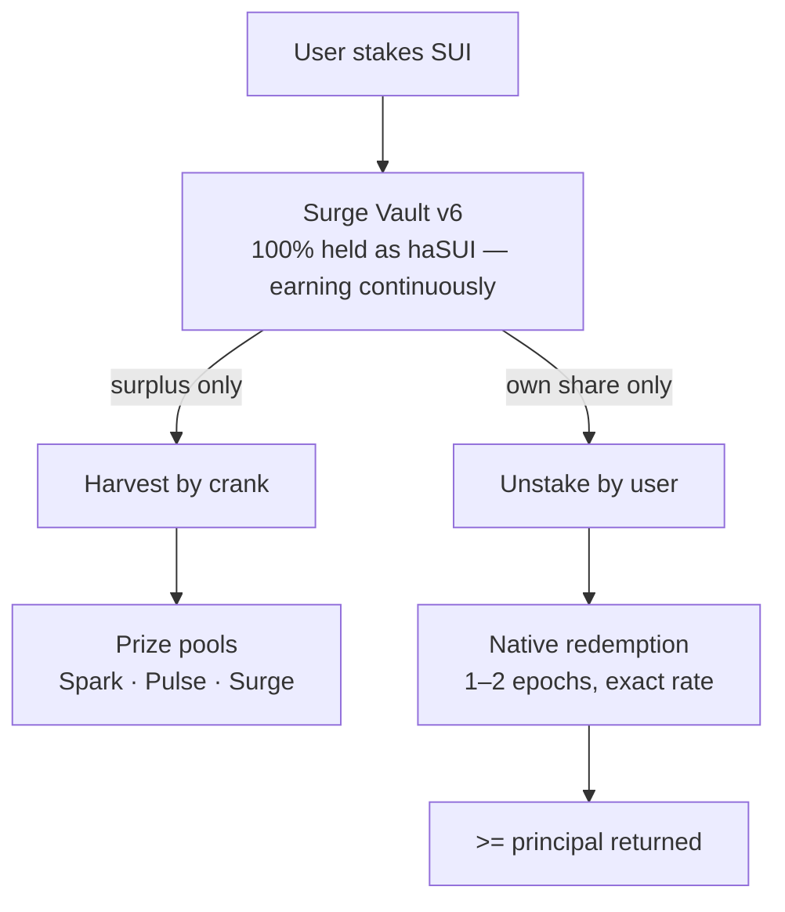

# v6 Architecture — haSUI Yield Engine (in development, testnet-validated)

> **Status:** designed, unit-tested (7/7), and validated end-to-end on Sui testnet
> against Haedal's live deployment. **Not yet on mainnet** — v6 is fund-custody
> code and will be audited before it opens for real TVL. The current mainnet
> deployment remains V5.

## Why v6

V5 delegates natively to a validator. Its harvest withdraws and re-stakes the
**entire pool**, resetting the staking warmup for everyone — at scale, frequent
withdrawals would collapse the pool's yield. v6 fixes this at the root: the
vault holds **haSUI** (Haedal's liquid staking token) instead of native
`StakedSui`. haSUI appreciates against SUI continuously, so:

- **Every staked SUI earns from the second it arrives.** No warmup, ever.
- **O(1) at any TVL.** Nothing is re-staked, regardless of pool size or churn.
- **One user's exit never touches anyone else's stake.**

## How it works



An unstake releases only that user's share: the vault computes the exact haSUI
covering their principal at the current on-chain rate and sends it into
Haedal's native delayed redemption (fee-free, exact rate, 1–2 epochs). Every
other staker's haSUI keeps compounding untouched.

## No-loss enforcement is on-chain

Harvest can mathematically never reach principal. The contract reads the
haSUI/SUI exchange rate from Haedal's on-chain `Staking` object and only ever
releases

```
surplus = ha_balance − ceil(total_principal / rate) − safety_margin (10 bps)
```

Even a fully compromised crank key cannot withdraw principal through
`harvest` — the coverage check is enforced by the contract, not by the
operator. Principal never passes through the crank; only yield does.

Because the haSUI rate is monotonically increasing, the haSUI released for a
withdrawal always redeems to **≥ the user's principal** (ceiling rounding,
proven in unit tests across rate/amount combinations).

## What we depend on

Honest trade-off: the no-loss guarantee now also depends on haSUI staying
solvent and redeemable at its stated rate. Mitigations: haSUI is the largest
and oldest Sui LST (live since 2023, audited, $200M+ TVL); principal exits use
**native redemption only** (exact rate, no DEX slippage — DEX swaps are
reserved for yield, where slippage is harmless); and Surge v6 itself will be
audited before real TVL is accepted.

## Testnet validation (June 2026)

Validated against Haedal's live testnet deployment
(package `0x771b0ab9…`, staking object `0xb399662a…`):

| Step | Result | Tx digest |
|---|---|---|
| `stake` 1 SUI → haSUI locked in vault | ✅ Haedal `UserStaked` + `StakedV6` events | `CLFsBfeQVRXPUxt1ALscwGSejT8j8CZtPNFVqZUPD6ez` |
| `request_unstake` → native redemption ticket | ✅ Haedal `UserNormalUnstaked` + `UnstakedV6` | `CuBKaNnTNvpM56pY6Bt69a44rqrJuKsPwZtrN1jBcZdU` |
| `harvest` with zero yield | ✅ correctly aborts (`E_NOTHING_TO_HARVEST`) | `DN16WseSe6Dq…` |
| `claim_v2` after maturity → SUI returned | ✅ | _(added after claim)_ |

Unit tests: `sui move test v6` — 7/7 passing, covering ceiling-rounding
no-loss properties, harvest coverage invariants, dust thresholds, full
lifecycle with the three stake gates (1/10/50 SUI), and full exit immediately
after harvest.

## Files

- `sources/stake_vault_v6.move` — the v6 vault (stake, unstake, harvest,
  reward routing)
- `sources/stake_vault_v6_tests.move` — invariant test suite
- `haedal_stub/` — compile-time interface stubs for Haedal's package
  (signatures verified against mainnet via `sui_getNormalizedMoveModule`;
  runtime links to Haedal's published package via `published-at`)

## Rollout plan

1. ✅ Design + unit tests + testnet validation
2. Security audit (v6 is custody code — non-negotiable before real TVL)
3. Mainnet deployment with conservative TVL cap
4. Frontend + crank v3 migration (event subscription `StakedV6`/`UnstakedV6`)
5. V5 wind-down: existing stakers withdraw and re-stake into v6
